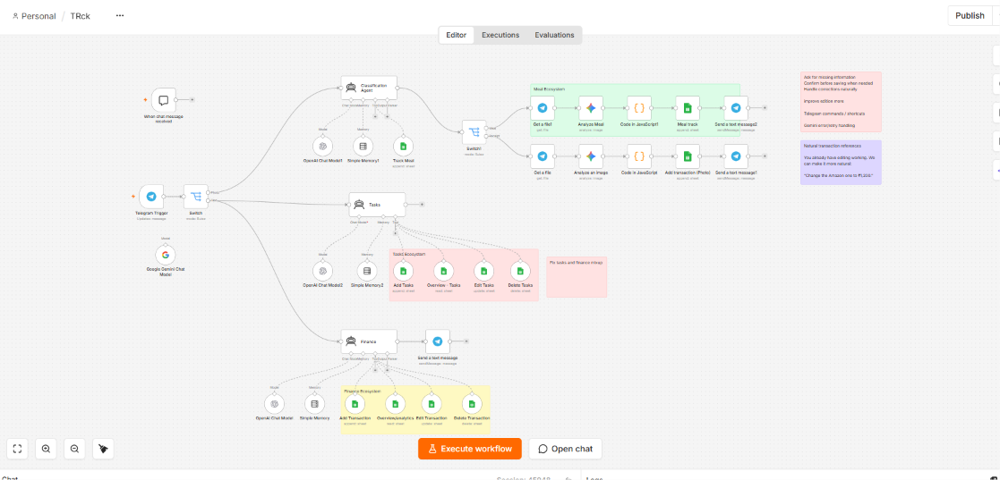

# AI Personal Assistant & Life Management Automation | n8n

## Overview

An AI-powered personal assistant built with **n8n** that uses Telegram as the primary interface for managing tasks, meals, finances, and general requests.

The workflow uses AI agents to understand natural-language requests, route them to the appropriate workflow, process the data, and store structured information in Google Sheets.

Users can interact with the assistant through **text messages or photos**, making it possible to add meal records and finance/bill information directly from Telegram.

## Workflow Architecture

Project Preview
The workflow architecture is shown below: 


The workflow consists of specialized AI-powered agents for:

- Chat and general assistance
- Task management
- Meal tracking
- Finance and expense tracking

## Key Features

### AI Personal Assistant

- Accepts natural-language requests through Telegram
- Uses AI agents to understand and route user requests
- Provides responses directly through Telegram
- Uses memory to maintain conversational context

### Task Management

Tasks can be created and managed using natural-language messages.

Examples:
- Add a task
- Update a task
- Delete a task
- Track pending tasks

Task data is stored and managed through **Google Sheets**.

### Meal Tracking

The assistant can track meals through Telegram.

Users can:
- Add meal information using text
- Upload a meal photo through Telegram
- Process the submitted information
- Store meal records in Google Sheets

### Finance & Expense Tracking

The Finance workflow allows users to manage expenses through Telegram.

Users can:
- Add expenses using text
- Upload a photo of a bill or receipt
- Process the submitted information
- Store financial transaction data in Google Sheets

### AI-Powered Data Processing

The workflow uses AI to interpret user inputs and convert unstructured information into structured data.

For example:

```text
Telegram Message / Photo
          ↓
       AI Agent
          ↓
   Request Classification
          ↓
 ┌────────┬────────┬────────┐
 │ Tasks  │  Meals │ Finance│
 └────────┴────────┴────────┘
          ↓
    Data Processing
          ↓
     Google Sheets
          ↓
   Telegram Response


**Technology Stack**
- n8n – Workflow automation and orchestration
- AI Agents – Natural-language understanding and task routing
- OpenAI / AI Models – AI-powered processing
- Google Gemini – AI model integration
- Telegram Bot – User interface and communication
- Google Sheets – Data storage and tracking
- JavaScript – Data processing and transformation
- APIs – External service integration

**Workflow Components**
Chat Assistant
Handles general requests, conversation, file processing, AI analysis, and responses.
Task Agent
Manages task creation, updates, deletion, and tracking.
Meal Tracker
Processes meal information submitted through text or images and records it in Google Sheets.
Finance Agent
Processes financial transactions and bill/receipt images and records expense information in Google Sheets.

**Use Cases**
- Personal AI assistant
- Task and productivity management
- Meal and food tracking
- Expense and finance tracking
- Receipt and bill processing
- AI-powered data extraction
- Telegram-based automation
- Personal workflow automation

**Skills Demonstrated**
- n8n workflow automation
- AI agent workflows
- Natural-language processing
- AI-powered data extraction
- Image-based data processing
- Telegram bot integration
- Google Sheets integration
- JavaScript data processing
- API integration
- Workflow design and automation

**Project Highlights**
- Designed a multi-agent AI workflow using n8n.
- Built specialized workflows for task, meal, and finance management.
- Enabled both text and image-based data input through Telegram.
- Automated the conversion of unstructured user inputs into structured data.
- Integrated Google Sheets for centralized data storage and tracking.
- Used AI and automation to reduce repetitive manual data-entry tasks.
     Google Sheets
          ↓
   Telegram Response
